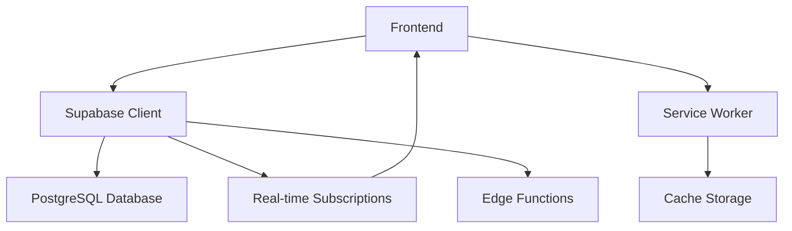

# 💅 Sistema de Agendamento para Salões de Beleza

<div align="center">


[](https://github.com/LELEOU/App-de-Agendamento/blob/main/LICENSE)
[](https://github.com/LELEOU/App-de-Agendamento/pulls)
[](https://github.com/LELEOU/App-de-Agendamento)

**Uma solução completa e moderna para gerenciamento de salões de beleza**

[🚀 Demo ao Vivo](https://app-de-agendamento.vercel.app) • [📖 Documentação](https://github.com/LELEOU/App-de-Agendamento/wiki) • [🐛 Reportar Bug](https://github.com/LELEOU/App-de-Agendamento/issues)

</div>

---

## 📋 Índice

- [🌟 Características](#-características)
- [🚀 Tecnologias](#-tecnologias)
- [📦 Instalação](#-instalação)
- [⚙️ Configuração](#️-configuração)
- [🔧 Uso](#-uso)
- [🏗️ Arquitetura](#️-arquitetura)
- [🔒 Segurança](#-segurança)
- [🌐 Deploy](#-deploy)
- [🤝 Contribuição](#-contribuição)
- [📄 Licença](#-licença)

## 🌟 Características

### 📅 **Agendamento Inteligente**
- Interface intuitiva para marcação de horários
- Prevenção de conflitos automática
- Visualização em calendário mensal/semanal
- Limite de uma solicitação por dia para evitar spam

### 👥 **Gestão de Usuários**
- Sistema de permissões por função (Admin, Manicure, Recepcionista)
- Perfis personalizados para clientes e funcionários
- Controle de acesso granular por seção

### 📊 **Relatórios e Analytics**
- Dashboard com métricas em tempo real
- Relatórios individuais por manicure
- Análise de performance e produtividade
- Exportação de dados em múltiplos formatos

### 📱 **Progressive Web App (PWA)**
- Funciona offline com sincronização automática
- Instalável em qualquer dispositivo
- Notificações push nativas
- Interface responsiva (mobile-first)

### 🎨 **Experiência do Usuário**
- Tema escuro/claro com transições suaves
- Suporte a múltiplos idiomas (PT-BR, EN-US)
- Animações fluidas e feedback visual
- Acessibilidade (WCAG 2.1)

### 🔔 **Sistema de Notificações**
- Notificações push em tempo real
- Lembretes automáticos de agendamentos
- Fallback para notificações nativas do browser
- Configurações personalizáveis por usuário

## 🚀 Tecnologias

### **Frontend**
- **JavaScript Vanilla** - Performance máxima sem frameworks pesados
- **HTML5** - Semântica moderna e acessibilidade
- **CSS3** - Animações e layouts avançados
- **TailwindCSS** - Estilização utilitária e responsiva

### **Backend & Banco de Dados**
- **Supabase** - Backend-as-a-Service com PostgreSQL
- **Row Level Security (RLS)** - Segurança nativa do PostgreSQL
- **Real-time subscriptions** - Atualizações em tempo real
- **Edge Functions** - Processamento serverless

### **Build & Deploy**
- **Vite** - Build tool moderna e rápida
- **Service Workers** - Cache inteligente e funcionamento offline
- **Web App Manifest** - Instalação PWA
- **Environment Variables** - Configuração segura

### **Qualidade & Ferramentas**
- **ESLint** - Padronização de código
- **Prettier** - Formatação automática
- **Git Hooks** - Validação pré-commit
- **Semantic Versioning** - Versionamento consistente

## 📦 Instalação

### **Pré-requisitos**
- Node.js 18+ 
- npm ou yarn
- Conta no Supabase

### **Passo a passo**

1. **Clone o repositório**
```bash
git clone https://github.com/LELEOU/App-de-Agendamento.git
cd App-de-Agendamento
```

2. **Instale as dependências**
```bash
npm install
```

3. **Configure as variáveis de ambiente**
```bash
cp .env.example .env
# Edite o arquivo .env com suas credenciais
```

4. **Configure o banco de dados**
```bash
# Execute o script SQL no seu projeto Supabase
# Arquivo: src/database-setup.sql
```

5. **Inicie o servidor de desenvolvimento**
```bash
npm run dev
```

6. **Acesse a aplicação**
```
http://localhost:5173
```

## ⚙️ Configuração

### **Variáveis de Ambiente**

Crie um arquivo `.env` baseado no `.env.example`:

```env
# Configurações do Supabase (OBRIGATÓRIO)
VITE_SUPABASE_URL=https://your-project-ref.supabase.co
VITE_SUPABASE_ANON_KEY=your-anon-key-here

# Configurações opcionais
VITE_APP_TITLE=Sistema de Agendamento para Salões
VITE_APP_VERSION=1.0.0
```

### **Configuração do Supabase**

1. **Crie um projeto no [Supabase](https://supabase.com)**

2. **Execute o script de configuração do banco**
   - Acesse o SQL Editor no dashboard do Supabase
   - Execute o conteúdo do arquivo `src/database-setup.sql`

3. **Configure as políticas RLS**
   - As políticas de segurança já estão incluídas no script SQL
   - Verifique se estão ativas na seção Authentication

4. **Obtenha suas credenciais**
   - Acesse Settings > API
   - Copie a URL do projeto e a chave anônima

### **Estrutura do Banco de Dados**

```sql
-- Principais tabelas
users          -- Usuários do sistema
appointments   -- Agendamentos
services       -- Serviços oferecidos
schedules      -- Horários disponíveis
notifications  -- Notificações
settings       -- Configurações do sistema
```

## 🔧 Uso

### **Acesso por Função**

#### 👑 **Administrador**
- Acesso total ao sistema
- Gerenciamento de usuários e permissões
- Configurações globais
- Relatórios completos

#### 💅 **Manicure**
- Visualização dos próprios agendamentos
- Acesso aos relatórios pessoais
- Atualização de status dos serviços

#### 📞 **Recepcionista**
- Criação e edição de agendamentos
- Gerenciamento de clientes
- Visualização de agenda geral

### **Fluxo Principal**

1. **Login** - Autenticação via Supabase Auth
2. **Dashboard** - Visão geral baseada na função
3. **Agendamento** - Criação/edição de horários
4. **Relatórios** - Análise de dados e performance
5. **Configurações** - Personalização do sistema

## 🏗️ Arquitetura

### **Estrutura de Pastas**
```
app/
├── src/
│   ├── assets/          # Recursos estáticos
│   │   ├── icon/        # Ícones e favicons
│   │   └── imgs/        # Imagens
│   ├── css/             # Estilos
│   │   └── style.css    # CSS principal
│   ├── js/              # JavaScript
│   │   ├── app-supabase-final.js  # Lógica principal
│   │   ├── supabase-config.js     # Configuração do Supabase
│   │   ├── cache/       # Gerenciamento de cache
│   │   ├── notifications/  # Sistema de notificações
│   │   ├── themes/      # Gerenciamento de temas
│   │   └── translations/   # Internacionalização
│   ├── database-setup.sql  # Schema do banco
│   ├── index.html       # Página principal
│   └── manifest.json    # Configuração PWA
├── capacitor.config.json # Configuração mobile (futuro)
├── package.json
├── vite.config.ts       # Configuração do Vite
└── sw.js               # Service Worker
```

### **Fluxo de Dados**



### **Componentes Principais**

- **App Core** (`app-supabase-final.js`) - Lógica principal da aplicação
- **Database Layer** (`supabase-config.js`) - Abstração do banco de dados
- **UI Components** - Componentes reutilizáveis em JavaScript vanilla
- **PWA Shell** - Service Worker e cache para funcionamento offline

## 🔒 Segurança

### **Autenticação & Autorização**
- ✅ JWT tokens com expiração automática
- ✅ Row Level Security (RLS) no PostgreSQL
- ✅ Validação de permissões por função
- ✅ Sanitização de inputs

### **Proteção de Dados**
- ✅ HTTPS obrigatório em produção
- ✅ Criptografia de dados sensíveis
- ✅ Backup automático do Supabase
- ✅ Logs de auditoria

### **Best Practices**
- ✅ Variáveis de ambiente para credenciais
- ✅ Headers de segurança (CSP, HSTS)
- ✅ Validação client-side e server-side
- ✅ Rate limiting nas APIs

## 🌐 Deploy

### **Deploy no Vercel (Recomendado)**

1. **Conecte seu repositório**
```bash
npm i -g vercel
vercel login
vercel --prod
```

2. **Configure as variáveis de ambiente**
   - Acesse o dashboard do Vercel
   - Adicione as variáveis do arquivo `.env`

3. **Deploy automático**
   - Pushes na branch `main` fazem deploy automaticamente

### **Deploy Alternativo**

#### **Netlify**
```bash
npm run build
# Upload da pasta dist/ para Netlify
```

#### **GitHub Pages**
```bash
npm run build
npm run deploy
```

#### **Docker**
```dockerfile
FROM node:18-alpine
WORKDIR /app
COPY package*.json ./
RUN npm ci --only=production
COPY . .
RUN npm run build
EXPOSE 3000
CMD ["npm", "start"]
```

## 🤝 Contribuição

Contribuições são sempre bem-vindas! 

### **Como Contribuir**

1. **Fork** o projeto
2. **Crie** uma branch para sua feature (`git checkout -b feature/AmazingFeature`)
3. **Commit** suas mudanças (`git commit -m 'Add some AmazingFeature'`)
4. **Push** para a branch (`git push origin feature/AmazingFeature`)
5. **Abra** um Pull Request

### **Diretrizes**

- 📝 Descreva claramente as mudanças
- ✅ Adicione testes quando necessário
- 📚 Atualize a documentação
- 🎨 Siga os padrões de código estabelecidos

### **Reportando Bugs**

Use as [Issues do GitHub](https://github.com/LELEOU/App-de-Agendamento/issues) com:
- 🐛 Descrição detalhada do problema
- 🔄 Passos para reproduzir
- 💻 Informações do ambiente
- 📸 Screenshots quando relevante

## 📊 Roadmap

### **v1.1.0** (Próxima versão)
- [ ] Integração com WhatsApp Business API
- [ ] Sistema de fidelidade para clientes
- [ ] Relatórios avançados com gráficos
- [ ] App móvel nativo (Capacitor)

### **v1.2.0** (Futuro)
- [ ] Integração com sistemas de pagamento
- [ ] IA para sugestão de horários
- [ ] Multi-tenancy para múltiplos salões
- [ ] API pública para integrações

## 📄 Licença

Distribuído sob a licença MIT. Veja `LICENSE` para mais informações.

## 👥 Equipe

- **Desenvolvedor Principal** - [@LELEOU](https://github.com/LELEOU)

## 🙏 Agradecimentos

- [Supabase](https://supabase.com) - Backend-as-a-Service incrível
- [TailwindCSS](https://tailwindcss.com) - Framework CSS utilitário
- [Vite](https://vitejs.dev) - Build tool super rápida
- Comunidade open source

---

<div align="center">

**⭐ Deixe uma estrela se este projeto te ajudou! ⭐**

[🔝 Voltar ao topo](#-sistema-de-agendamento-para-salões-de-beleza)

</div>
